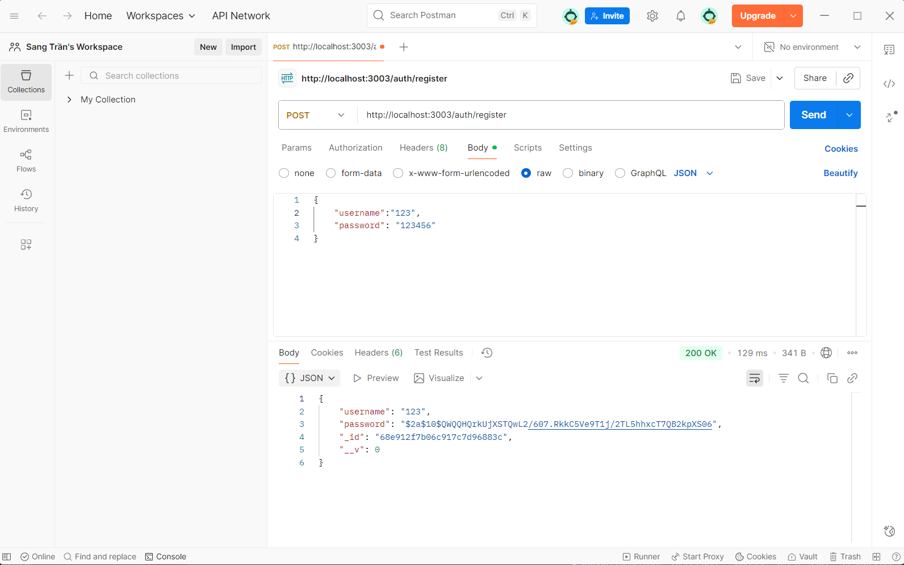
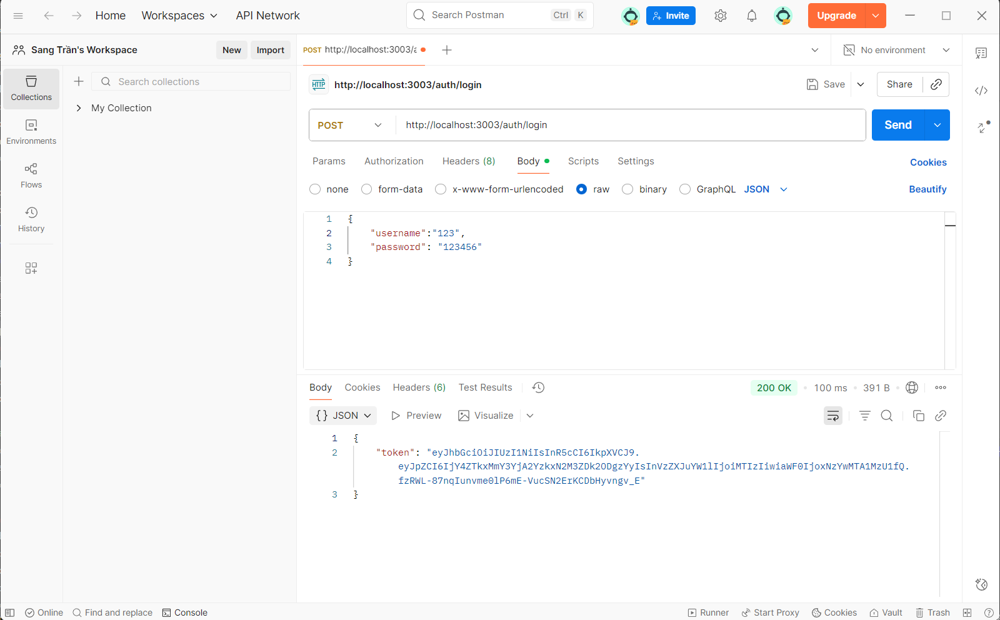
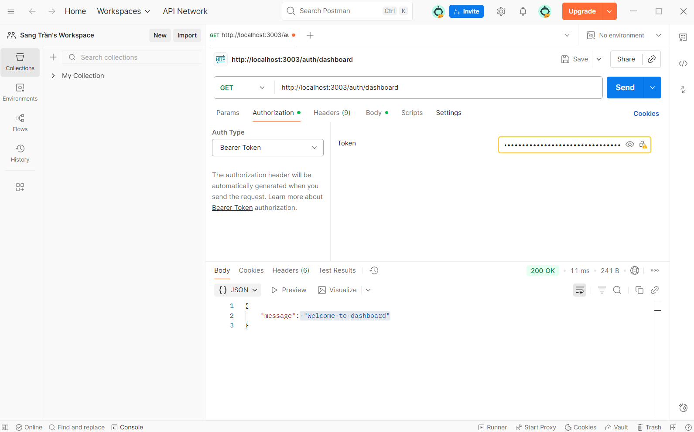
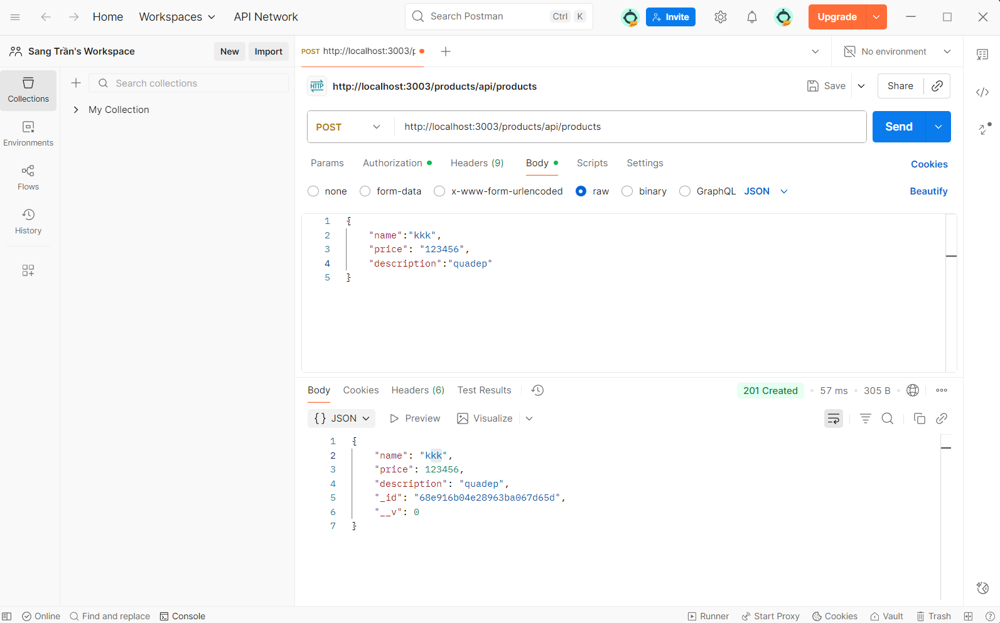
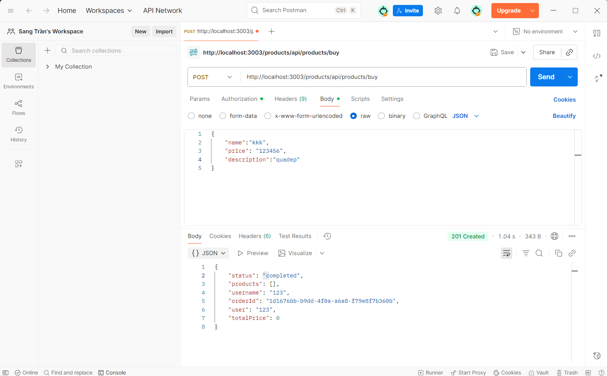
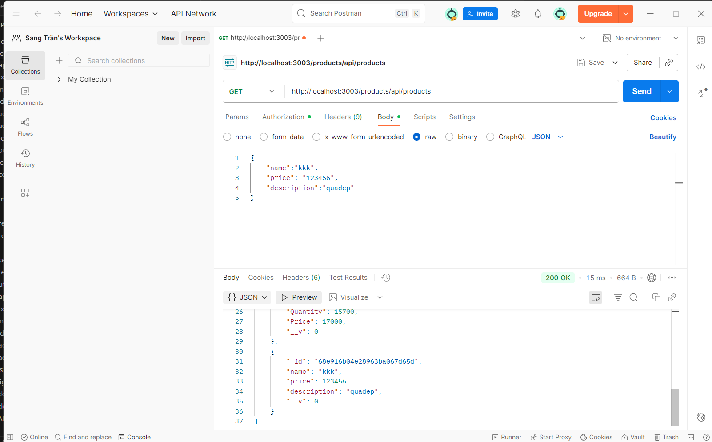

# EProject Phase 1 - Microservices E-Commerce Platform

## 📋 Tổng quan dự án

Đây là một hệ thống thương mại điện tử được xây dựng theo kiến trúc microservices, bao gồm các dịch vụ authentication, product management, order processing và API gateway. Hệ thống sử dụng RabbitMQ để giao tiếp giữa các services và MongoDB để lưu trữ dữ liệu.

## 🏗️ Kiến trúc hệ thống

```
EProject-Phase-1/
├── api-gateway/           # API Gateway - Port 3003
├── auth/                  # Authentication Service - Port 3000
├── product/               # Product Service - Port 3001
├── order/                 # Order Service - Port 3002
├── utils/                 # Shared utilities
├── img/                   # Documentation images
└── README.md
```

### Services Overview

| Service | Port | Database | Mô tả |
|---------|------|----------|-------|
| **API Gateway** | 3003 | - | Proxy requests to các microservices |
| **Auth Service** | 3000 | MongoDB (auth) | Quản lý đăng ký, đăng nhập, JWT tokens |
| **Product Service** | 3001 | MongoDB (products) | Quản lý sản phẩm, xử lý đơn hàng |
| **Order Service** | 3002 | MongoDB (orders) | Xử lý và lưu trữ đơn hàng |

## 🚀 Cài đặt và chạy dự án

### Yêu cầu hệ thống
- Node.js (v14+)
- MongoDB
- RabbitMQ

### 1. Clone repository
```bash
git clone <repository-url>
cd EProject-Phase-1
```

### 2. Cài đặt dependencies
```bash
# Cài đặt dependencies chính
npm install

# Cài đặt dependencies cho từng service
cd auth && npm install && cd ..
cd product && npm install && cd ..
cd order && npm install && cd ..
cd api-gateway && npm install && cd ..
```

### 3. Cấu hình environment variables

Tạo file `.env` trong thư mục gốc:
```env
# Database
MONGODB_AUTH_URI=
MONGODB_PRODUCT_URI=
MONGODB_ORDER_URI=

# JWT
JWT_SECRET=your_jwt_secret_key

# RabbitMQ
RABBITMQ_URI=

### 4. Khởi động services

**Cách 1: Chạy từng service riêng biệt**
```bash
# Terminal 1 - Auth Service
cd auth && npm start

# Terminal 2 - Product Service  
cd product && npm start

# Terminal 3 - Order Service
cd order && npm start

# Terminal 4 - API Gateway
cd api-gateway && npm start
```

**Cách 2: Sử dụng concurrently (recommended)**
```bash
npm install -g concurrently
concurrently "cd auth && npm start" "cd product && npm start" "cd order && npm start" "cd api-gateway && npm start"
```

## 📚 API Documentation

### Base URLs
- **Direct Access**: `http://localhost:[port]`
- **Via API Gateway**: `http://localhost:3003`

### Authentication Service (Port 3000)

#### 1. Đăng ký người dùng
```http
POST /register
Content-Type: application/json

{
  "username": "testuser",
  "password": "password123"
}
```

#### 2. Đăng nhập
```http
POST /login
Content-Type: application/json

{
  "username": "testuser", 
  "password": "password123"
}
```

**Response:**
```json
{
  "token": "eyJhbGciOiJIUzI1NiIsInR5cCI6IkpXVCJ9..."
}
```

#### 3. Test protected route
```http
GET /dashboard
Authorization: Bearer <your_jwt_token>
```

### Product Service (Port 3001)

#### 1. Tạo sản phẩm mới
```http
POST /api/products
Authorization: Bearer <your_jwt_token>
Content-Type: application/json

{
  "name": "iPhone 15",
  "price": 999,
  "description": "Latest iPhone model"
}
```

#### 2. Lấy danh sách sản phẩm
```http
GET /api/products
Authorization: Bearer <your_jwt_token>
```

#### 3. Mua hàng (Tạo đơn hàng)
```http
POST /api/products/buy
Authorization: Bearer <your_jwt_token>
Content-Type: application/json

{
  "ids": ["product_id_1", "product_id_2"]
}
```

### Order Service (Port 3002)
Service này chỉ xử lý messages từ RabbitMQ, không có HTTP endpoints.

## 🔧 Message Queue Architecture

Hệ thống sử dụng RabbitMQ để giao tiếp bất đồng bộ:

```
Product Service → [orders queue] → Order Service
Order Service → [products queue] → Product Service
```

**Flow tạo đơn hàng:**
1. User gọi `POST /api/products/buy`
2. Product Service gửi message tới `orders` queue
3. Order Service nhận message, tính tổng tiền, lưu DB
4. Order Service gửi response tới `products` queue
5. Product Service trả kết quả cho user

## 🧪 Testing

### Unit Tests
```bash
# Run all tests
npm test

# Test specific service
cd auth && npm test
cd product && npm test
```

### Postman Testing

#### Workflow testing với Postman:

1. **Đăng ký tài khoản**
   

2. **Đăng nhập để lấy token**
   

3. **Test token với protected route**
   

4. **Thêm sản phẩm**
   

5. **Tạo đơn hàng**
   

6. **Xem danh sách sản phẩm**
   